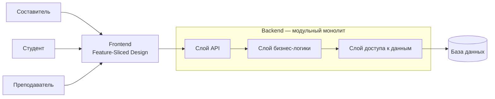
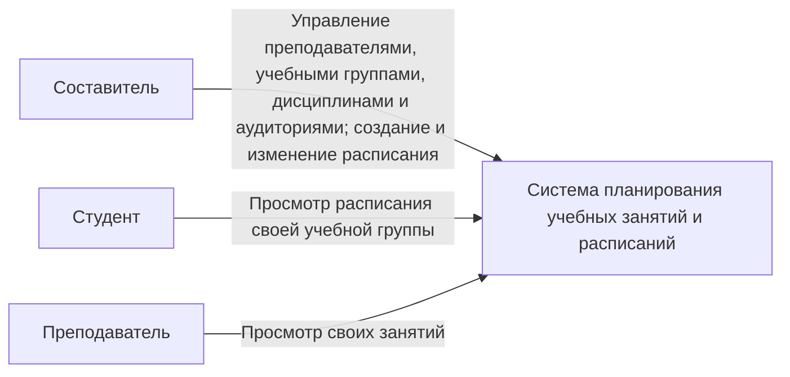
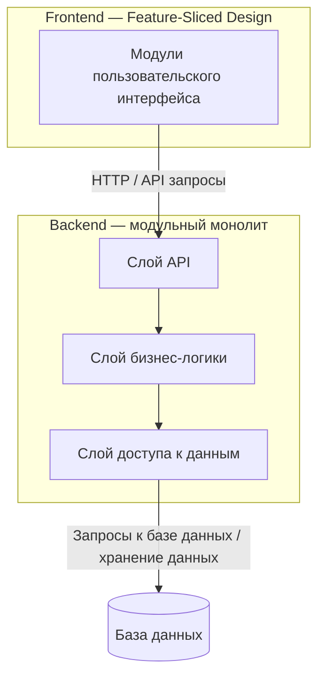

# Программа для планирования учебных занятий и расписаний

## 1. Общие сведения

### 1.1 Основание для разработки

Проект разрабатывается в рамках лабораторных работ по дисциплине «Программная инженерия».

В качестве темы проекта выбрана «Программа для планирования учебных занятий и расписаний».

### 1.2 Наименование проекта

Полное наименование проекта: «Программа для планирования учебных занятий и расписаний».

### 1.3 Цель разработки

Целью проекта является разработка веб-приложения для составления, изменения и просмотра расписания учебных занятий.

Программа должна хранить данные о преподавателях, учебных группах, дисциплинах, аудиториях и занятиях, а также предотвращать создание занятий с временными конфликтами.

### 1.4 Состав работ

В рамках проекта необходимо:

1) определить требования к программе;
2) описать основные сущности, роли пользователей и сценарии работы;
3) спроектировать структуру программной системы;
4) реализовать основные сущности средствами Python;
5) реализовать хранение данных в базе данных;
6) реализовать серверную часть приложения;
7) реализовать веб-интерфейс;
8) реализовать проверку временных конфликтов занятий;
9) реализовать автоматизированные тесты;
10) разработать и документировать REST API.

## 2. Назначение программы

Программа предназначена для формирования и просмотра расписания учебных занятий для типовой учебной недели.

В системе используются три роли пользователей:

1) **Составитель** — создаёт и изменяет расписание, управляет данными, необходимыми для формирования занятий;
2) **Студент** — просматривает расписание своей учебной группы;
3) **Преподаватель** — просматривает занятия, в которых он указан преподавателем.

Программа должна обеспечивать:

1) хранение данных о преподавателях;
2) хранение данных об учебных группах;
3) хранение данных о дисциплинах;
4) хранение данных об аудиториях;
5) создание, изменение и удаление учебных занятий Составителем;
6) просмотр расписания;
7) фильтрацию расписания;
8) автоматическую проверку создаваемых и изменяемых занятий на наличие временных конфликтов.

Расписание формируется вручную для типовой учебной недели.

Автоматическая генерация оптимального расписания не входит в основную функциональность программы.

## 3. Описание программы

### 3.1 Общая схема работы

Программа представляет собой веб-приложение для формирования и просмотра учебного расписания.

Составитель работает с данными о преподавателях, учебных группах, дисциплинах и аудиториях. На основе этих данных создаются учебные занятия.

Каждое занятие связывает одного преподавателя, одну учебную группу, одну дисциплину и одну аудиторию и содержит информацию о времени проведения.

Перед созданием или изменением занятия программа проверяет наличие временных конфликтов.

Студент и Преподаватель не изменяют расписание и используют систему для его просмотра в пределах своей роли.

### 3.2 Основные сущности системы

В программе используются следующие основные сущности:

| Сущность | Основные свойства | Поведение в системе |
|---|---|---|
| **Преподаватель** | уникальный идентификатор, ФИО | используется при создании занятия; участвует в проверке временных конфликтов — преподаватель не может проводить два занятия в пересекающееся время; по преподавателю можно получить связанные с ним занятия |
| **Учебная группа** | уникальный идентификатор, наименование группы | используется при создании занятия; участвует в проверке временных конфликтов — группа не может находиться на двух занятиях в пересекающееся время; по группе формируется расписание |
| **Дисциплина** | уникальный идентификатор, наименование дисциплины | используется как атрибут занятия и определяет дисциплину, по которой проводится занятие |
| **Аудитория** | уникальный идентификатор, обозначение аудитории | используется при создании занятия; участвует в проверке временных конфликтов — аудитория не может использоваться двумя занятиями в пересекающееся время |
| **Занятие** | уникальный идентификатор, преподаватель, учебная группа, дисциплина, аудитория, день недели, время начала, время окончания | связывает основные сущности в рамках типовой учебной недели; создаётся, изменяется и удаляется Составителем; при создании и изменении автоматически проверяется на временные конфликты |

Каждая сущность имеет уникальный идентификатор, позволяющий однозначно определить конкретную запись в системе.

В основной версии программы одно занятие связано с одним преподавателем, одной учебной группой, одной дисциплиной и одной аудиторией.

### 3.3 Роли пользователей

В системе предусмотрены три фиксированные роли.

| Роль | Свойства | Возможности |
|---|---|---|
| **Составитель** | роль пользователя, ответственного за формирование расписания | управление преподавателями, группами, дисциплинами и аудиториями; создание, изменение и удаление занятий; просмотр всего расписания |
| **Студент** | связан с одной учебной группой | просмотр расписания своей учебной группы |
| **Преподаватель** | связан с соответствующим преподавателем в системе | просмотр занятий, в которых данный преподаватель указан как ведущий занятие |

Составитель обладает правами на изменение данных расписания.

Студент и Преподаватель используют функции просмотра и не должны изменять данные расписания.

Создание дополнительных типов ролей и настройка произвольных наборов прав в основной версии программы не предусматриваются.

### 3.4 Структура системы

Программа должна состоять из пользовательского интерфейса, серверной части и базы данных.

Frontend отвечает за отображение данных и взаимодействие пользователя с программой.

Backend принимает запросы от frontend, выполняет правила работы программы и взаимодействует с базой данных.

База данных используется для хранения преподавателей, учебных групп, дисциплин, аудиторий и занятий.

### 3.5 Формирование расписания

Расписание формируется для типовой учебной недели.

Для каждого занятия Составитель указывает:

1) дисциплину;
2) преподавателя;
3) учебную группу;
4) аудиторию;
5) день недели;
6) время начала занятия;
7) время окончания занятия.

Составитель должен иметь возможность создавать новые занятия, изменять существующие и удалять их.

Перед сохранением занятия программа должна проверить наличие временных конфликтов.

Конфликт возникает, если в пересекающееся время:

1) выбранный преподаватель уже проводит другое занятие;
2) выбранная учебная группа уже находится на другом занятии;
3) выбранная аудитория уже используется для другого занятия.

При обнаружении конфликта занятие не должно быть сохранено.

Система должна указать причину, по которой сохранение невозможно.

### 3.6 Просмотр расписания

Возможности просмотра расписания зависят от роли пользователя.

**Составитель** должен иметь возможность просматривать:

1) всё сформированное расписание;
2) расписание выбранной учебной группы;
3) занятия выбранного преподавателя;
4) занятость выбранной аудитории;
5) занятия за выбранный день недели.

**Студент** должен иметь возможность просматривать расписание учебной группы, с которой он связан.

**Преподаватель** должен иметь возможность просматривать занятия, в которых он указан преподавателем.

### 3.7 Основные сценарии использования

#### 3.7.1 Управление преподавателями, учебными группами, дисциплинами и аудиториями

Составитель должен иметь возможность просматривать, добавлять, изменять и удалять данные о преподавателях, учебных группах, дисциплинах и аудиториях.

Сохранённые данные используются при создании учебных занятий.

#### 3.7.2 Создание учебного занятия

Составитель выбирает дисциплину, преподавателя, учебную группу и аудиторию, после чего указывает день недели, время начала и время окончания занятия.

Программа проверяет введённые данные и наличие временных конфликтов.

Если конфликтов нет, занятие сохраняется и появляется в расписании.

Если обнаружен конфликт, программа не сохраняет занятие и указывает причину конфликта.

#### 3.7.3 Изменение учебного занятия

Составитель выбирает существующее занятие и изменяет необходимые данные.

Перед сохранением изменений программа повторно проверяет временные конфликты.

Само изменяемое занятие не учитывается при проверке его пересечения с другими занятиями.

#### 3.7.4 Удаление учебного занятия

Составитель выбирает существующее занятие и удаляет его из расписания.

#### 3.7.5 Просмотр расписания Составителем

Составитель открывает расписание и при необходимости фильтрует занятия по учебной группе, преподавателю, аудитории или дню недели.

#### 3.7.6 Просмотр расписания Студентом

Студент открывает расписание и получает список занятий своей учебной группы.

#### 3.7.7 Просмотр расписания Преподавателем

Преподаватель открывает расписание и получает список занятий, в которых он указан преподавателем.

### 3.8 Ограничения основной версии

В основную версию программы не входят:

1) автоматическая генерация оптимального расписания;
2) разделение учебной недели на числитель и знаменатель;
3) работа с расписанием по конкретным календарным датам;
4) учёт посещаемости студентов;
5) учёт успеваемости студентов;
6) отправка уведомлений;
7) мобильное приложение;
8) интеграция с внешними информационными системами образовательной организации;
9) создание дополнительных пользовательских ролей;
10) настройка произвольных прав доступа для пользовательских ролей.

В основной версии используются только роли Составитель, Студент и Преподаватель.

### 3.9 Контекстная схема системы

Контекстная схема показывает основные роли пользователей и их взаимодействие с системой планирования учебных занятий и расписаний.

Роль **Составитель** отвечает за управление основными сущностями системы и формирование учебного расписания.

Роль **Студент** использует систему для просмотра расписания своей учебной группы.

Роль **Преподаватель** использует систему для просмотра занятий, в которых он указан преподавателем.

### 3.10 Схема компонентов системы

Схема компонентов отражает внутреннюю структуру веб-приложения и взаимодействие его основных частей.

Frontend отвечает за взаимодействие пользователя с системой и организуется с использованием принципов Feature-Sliced Design.

Backend реализуется как модульный монолит и содержит три слоя:

1) слой API — принимает запросы и передаёт их на обработку;
2) слой бизнес-логики — реализует правила работы расписания и проверку временных конфликтов;
3) слой доступа к данным — выполняет получение и сохранение данных.

База данных используется для хранения преподавателей, учебных групп, дисциплин, аудиторий и занятий.

## 4. Требования к системе

### 4.1 Функциональные требования

#### 4.1.1 Управление преподавателями

Составитель должен иметь возможность:

1) добавлять преподавателей;
2) просматривать список преподавателей;
3) изменять данные преподавателей;
4) удалять преподавателей.

#### 4.1.2 Управление учебными группами

Составитель должен иметь возможность:

1) добавлять учебные группы;
2) просматривать список учебных групп;
3) изменять данные учебных групп;
4) удалять учебные группы.

#### 4.1.3 Управление дисциплинами

Составитель должен иметь возможность:

1) добавлять дисциплины;
2) просматривать список дисциплин;
3) изменять данные дисциплин;
4) удалять дисциплины.

#### 4.1.4 Управление аудиториями

Составитель должен иметь возможность:

1) добавлять аудитории;
2) просматривать список аудиторий;
3) изменять данные аудиторий;
4) удалять аудитории.

Преподаватель, учебная группа, дисциплина или аудитория не должны удаляться, если соответствующая запись используется в существующем занятии.

Перед удалением такой записи Составитель должен удалить или изменить связанные занятия.

#### 4.1.5 Управление учебными занятиями

Составитель должен иметь возможность:

1) создавать учебное занятие;
2) просматривать данные занятия;
3) изменять занятие;
4) удалять занятие.

Для занятия должны быть указаны:

1) дисциплина;
2) преподаватель;
3) учебная группа;
4) аудитория;
5) день недели;
6) время начала;
7) время окончания.

#### 4.1.6 Проверка временных конфликтов

При создании или изменении занятия программа должна проверять его на пересечение с другими существующими занятиями.

При изменении занятия само редактируемое занятие не учитывается при проверке пересечений.

Временные интервалы считаются конфликтующими, если они хотя бы частично пересекаются.

Если время окончания одного занятия совпадает со временем начала другого занятия, такие занятия конфликтующими не считаются.

Программа не должна сохранять занятие, если в пересекающееся время:

1) преподаватель уже назначен на другое занятие;
2) учебная группа уже назначена на другое занятие;
3) аудитория уже используется для другого занятия.

При обнаружении конфликта система должна указать его причину.

#### 4.1.7 Просмотр расписания

Возможности просмотра расписания должны зависеть от роли пользователя.

Составитель должен иметь возможность:

1) просматривать всё расписание;
2) фильтровать занятия по учебной группе;
3) фильтровать занятия по преподавателю;
4) фильтровать занятия по аудитории;
5) фильтровать занятия по дню недели.

Студент должен иметь возможность просматривать расписание учебной группы, с которой он связан.

Преподаватель должен иметь возможность просматривать занятия, в которых он указан преподавателем.

#### 4.1.8 Разграничение доступных действий

Изменение данных преподавателей, учебных групп, дисциплин, аудиторий и занятий должно быть доступно только Составителю.

Студенту и Преподавателю должны быть доступны только предусмотренные для их ролей функции просмотра расписания.

### 4.2 Нефункциональные требования

#### 4.2.1 Требования к корректности данных

Программа должна проверять вводимые данные перед их сохранением.

Запись не должна сохраняться, если обязательное поле не заполнено или содержит недопустимое значение.

Время окончания занятия должно быть позже времени его начала.

#### 4.2.2 Требования к пользовательскому интерфейсу

Пользовательский интерфейс должен обеспечивать доступ к функциям программы через веб-браузер.

При невозможности выполнения операции программа должна выводить осмысленное сообщение с указанием причины ошибки.

При обнаружении конфликта расписания сообщение должно указывать, какой вид конфликта обнаружен: конфликт преподавателя, учебной группы или аудитории.

#### 4.2.3 Требования к сохранению данных

Данные о преподавателях, учебных группах, дисциплинах, аудиториях и занятиях должны сохраняться в базе данных.

Сохранённые данные должны быть доступны после повторного запуска программы.

Удаление или изменение одной записи не должно приводить к некорректному изменению несвязанных данных.

#### 4.2.4 Требования к архитектуре программного обеспечения

Приложение должно разрабатываться как модульное монолитное веб-приложение.

Backend должен использовать трёхслойную архитектуру:

1) слой представления и API — принимает запросы и возвращает результаты;
2) слой бизнес-логики — реализует правила работы расписания и проверку временных конфликтов;
3) слой доступа к данным — выполняет получение и сохранение данных.

Frontend должен быть организован с использованием принципов Feature-Sliced Design.

Функциональные части программы должны быть разделены таким образом, чтобы изменение одного модуля не требовало внесения несвязанных изменений в остальные модули.

#### 4.2.5 Требования к тестируемости

Основные правила работы программы должны допускать автоматизированную проверку.

При тестировании необходимо проверять:

1) создание и изменение преподавателей, групп, дисциплин и аудиторий;
2) создание, изменение и удаление занятий;
3) проверку корректности входных данных;
4) обнаружение конфликта преподавателя;
5) обнаружение конфликта учебной группы;
6) обнаружение конфликта аудитории;
7) случай, когда одно занятие начинается в момент окончания другого;
8) доступность действий в зависимости от роли пользователя.

### 4.3 Ограничения системы

В основной версии программы:

1) расписание составляется Составителем вручную;
2) расписание формируется для типовой учебной недели;
3) одно занятие связано с одним преподавателем, одной учебной группой, одной дисциплиной и одной аудиторией;
4) автоматическая генерация и оптимизация расписания не выполняются;
5) используются только три роли: Составитель, Студент и Преподаватель;
6) создание дополнительных ролей не предусматривается;
7) настройка произвольных наборов прав пользователей не предусматривается.

## 5. Состав и содержание работ по доработке программных средств

Программа для планирования учебных занятий и расписаний разрабатывается как самостоятельное веб-приложение.

Внешний программный продукт или reference-проект в качестве основы не используется. Поэтому работы в рамках данного проекта относятся к разработке собственной программной системы, а не к доработке существующего программного продукта.

В рамках разработки необходимо реализовать:

1) хранение данных о преподавателях, учебных группах, дисциплинах, аудиториях и занятиях;
2) создание, изменение и удаление преподавателей, учебных групп, дисциплин и аудиторий Составителем;
3) создание, изменение и удаление учебных занятий Составителем;
4) проверку занятий на временные конфликты;
5) просмотр расписания в зависимости от роли пользователя;
6) пользовательский веб-интерфейс;
7) серверную часть приложения;
8) хранение данных в базе данных;
9) автоматизированную проверку основных сценариев работы;
10) документирование способа запуска и использования программы.

Разрабатываемая система должна соответствовать требованиям, описанным в разделах 1–4 настоящего README.md.

## 6. Состав и содержание работ по развертыванию

### 6.1 Общие требования

Веб-приложение должно запускаться с использованием Docker Compose.

Один и тот же способ запуска должен применяться на компьютере участника команды и на компьютере преподавателя.

Для запуска проекта на компьютере должны быть установлены Docker и Docker Compose.

Ручная установка зависимостей приложения вне контейнеров не должна требоваться.

### 6.2 Состав развертываемых компонентов

С помощью Docker Compose должны запускаться все компоненты, необходимые для работы веб-приложения, включая серверную часть и базу данных.

Если frontend разворачивается как отдельный сервис, его запуск также должен выполняться через Docker Compose.

Дополнительные сервисы включаются в состав развертывания только в том случае, если они требуются для реализации функций, уже указанных в техническом задании.

### 6.3 Конфигурация проекта

Параметры, которые могут отличаться в разных окружениях, должны задаваться через переменные окружения.

В репозитории должен находиться пример файла конфигурации без секретных значений.

Пользователь должен иметь возможность подготовить конфигурацию на основе этого примера без изменения исходного кода программы.

### 6.4 Порядок запуска

Для запуска приложения необходимо:

1) получить актуальную версию проекта из репозитория GitHub;
2) подготовить файл переменных окружения на основе примера, если он требуется;
3) выполнить команду `docker compose up --build`;
4) дождаться запуска компонентов приложения;
5) открыть веб-приложение в браузере по адресу, указанному в README.md.

После запуска должны быть доступны функции, предусмотренные для ролей Составитель, Студент и Преподаватель.

### 6.5 Остановка приложения и сохранение данных

Для остановки приложения должна использоваться команда:

`docker compose down`

Остановка и повторный запуск контейнеров не должны приводить к потере сохранённых данных.

Данные базы данных должны храниться в постоянном Docker volume.

## 7. Порядок контроля и приемки

### 7.1 Общие положения

Проверка программы выполняется с помощью набора сценариев, охватывающих штатное и внештатное поведение системы.

Для каждого сценария определяются:

1) предварительные условия;
2) выполняемое действие;
3) ожидаемый результат.

Программа считается работающей корректно, если она выполняет допустимые действия в соответствии с требованиями и отклоняет недопустимые действия с указанием причины.

### 7.2 Проверка основных сценариев

| № | Сценарий | Предварительные условия | Действие | Ожидаемый результат |
|---|---|---|---|---|
| 1 | Создание преподавателя | Составитель находится в разделе преподавателей и вводит корректные обязательные данные | Добавить нового преподавателя | Преподаватель сохраняется и появляется в списке |
| 2 | Изменение данных сущности | Существует преподаватель, учебная группа, дисциплина или аудитория | Изменить данные выбранной сущности и сохранить изменения | Обновлённые данные сохраняются и отображаются в системе |
| 3 | Создание занятия без конфликта | Существуют преподаватель, группа, дисциплина и аудитория; выбранный временной интервал свободен | Создать новое занятие | Занятие сохраняется и появляется в расписании |
| 4 | Изменение занятия без конфликта | В расписании существует занятие; новые данные не создают конфликтов | Изменить данные занятия и сохранить изменения | Изменения сохраняются; редактируемое занятие не рассматривается как конфликтующее само с собой |
| 5 | Удаление занятия | В расписании существует занятие | Удалить выбранное занятие | Занятие удаляется из расписания |
| 6 | Конфликт преподавателя | У преподавателя уже существует занятие в пересекающееся время | Создать второе занятие для того же преподавателя на пересекающийся интервал | Новое занятие не сохраняется; отображается причина конфликта |
| 7 | Конфликт учебной группы | У группы уже существует занятие в пересекающееся время | Создать другое занятие той же группы на пересекающийся интервал | Новое занятие не сохраняется; отображается причина конфликта |
| 8 | Конфликт аудитории | Аудитория уже используется в пересекающееся время | Создать занятие в той же аудитории на пересекающийся интервал | Новое занятие не сохраняется; отображается причина конфликта |
| 9 | Соприкасающиеся интервалы | Существующее занятие заканчивается, например, в 10:00 | Создать другое занятие с началом в 10:00 | Новое занятие сохраняется, так как интервалы не пересекаются |
| 10 | Некорректное время занятия | Существуют все необходимые связанные сущности | Указать время окончания, которое раньше времени начала или совпадает с ним | Занятие не сохраняется; отображается сообщение о некорректном времени |
| 11 | Просмотр расписания Студентом | Студент связан с учебной группой; для группы существуют занятия | Открыть расписание | Отображаются занятия соответствующей учебной группы |
| 12 | Просмотр расписания Преподавателем | Преподаватель связан с соответствующим преподавателем в системе; для него существуют занятия | Открыть расписание | Отображаются занятия данного преподавателя |
| 13 | Попытка изменения расписания Студентом или Преподавателем | Пользователь работает в роли Студента или Преподавателя | Попытаться выполнить действие, изменяющее данные расписания | Изменение не выполняется; пользователю недоступны функции изменения расписания |
| 14 | Удаление используемой сущности | Преподаватель, группа, дисциплина или аудитория используются в существующем занятии | Попытаться удалить используемую запись | Удаление не выполняется; отображается причина невозможности удаления |
| 15 | Повторный запуск приложения | В базе данных уже сохранены записи | Остановить приложение и запустить его повторно | Ранее сохранённые данные остаются доступными |

### 7.3 Проверка развертывания

Перед приемкой необходимо проверить запуск проекта на компьютере, отличном от компьютера разработчика.

Проверка выполняется следующим образом:

1) проект получают из репозитория;
2) подготавливают необходимые переменные окружения;
3) выполняют `docker compose up --build`;
4) убеждаются, что необходимые компоненты приложения успешно запущены;
5) открывают приложение в браузере;
6) выполняют основные сценарии из раздела 7.2;
7) останавливают приложение;
8) повторно запускают приложение;
9) проверяют сохранность ранее созданных данных.

### 7.4 Критерии приемки

Работа считается принятой, если:

1) приложение запускается через Docker Compose без изменения исходного кода;
2) основные функции, описанные в разделе 4 README.md, выполняются в соответствии с требованиями;
3) занятия с временными конфликтами не сохраняются;
4) корректные занятия сохраняются;
5) соприкасающиеся по времени занятия не считаются конфликтующими;
6) Студент и Преподаватель получают только предусмотренные для их ролей представления расписания;
7) Студент и Преподаватель не могут изменять данные расписания;
8) данные сохраняются после перезапуска приложения;
9) при недопустимой операции система сообщает причину отказа.
