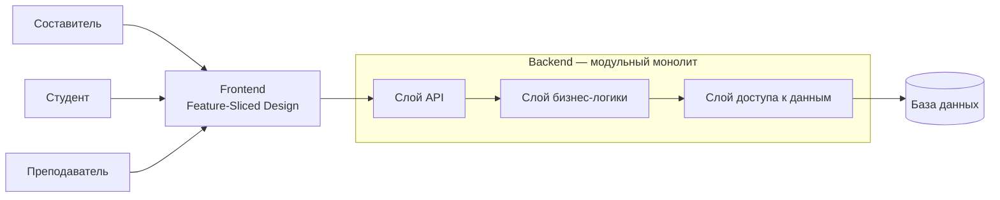

# Программа для планирования учебных занятий и расписаний

## 1. Общие сведения

### 1.1 Основание для разработки

Проект разрабатывается в рамках лабораторных работ по дисциплине «Программная инженерия».

В качестве темы проекта выбрана «Программа для планирования учебных занятий и расписаний».

### 1.2 Наименование проекта

Полное наименование проекта: «Программа для планирования учебных занятий и расписаний».

### 1.3 Цель разработки

Целью проекта является разработка веб-приложения для составления, изменения и просмотра расписания учебных занятий.

Программа должна хранить данные о преподавателях, учебных группах, дисциплинах, аудиториях и занятиях, а также предотвращать создание занятий с временными конфликтами.

### 1.4 Состав работ

В рамках проекта необходимо:

1) определить требования к программе;
2) описать основные сущности, роли пользователей и сценарии работы;
3) спроектировать структуру программной системы;
4) реализовать основные сущности средствами Python;
5) реализовать хранение данных в базе данных;
6) реализовать серверную часть приложения;
7) реализовать веб-интерфейс;
8) реализовать проверку временных конфликтов занятий;
9) реализовать автоматизированные тесты;
10) разработать и документировать REST API.

## 2. Назначение программы

Программа предназначена для формирования и просмотра расписания учебных занятий для типовой учебной недели.

В системе используются три роли пользователей:

1) **Составитель** — создаёт и изменяет расписание, управляет данными, необходимыми для формирования занятий;
2) **Студент** — просматривает расписание своей учебной группы;
3) **Преподаватель** — просматривает занятия, в которых он указан преподавателем.

Программа должна обеспечивать:

1) хранение данных о преподавателях;
2) хранение данных об учебных группах;
3) хранение данных о дисциплинах;
4) хранение данных об аудиториях;
5) создание, изменение и удаление учебных занятий Составителем;
6) просмотр расписания;
7) фильтрацию расписания;
8) автоматическую проверку создаваемых и изменяемых занятий на наличие временных конфликтов.

Расписание формируется вручную для типовой учебной недели.

Автоматическая генерация оптимального расписания не входит в основную функциональность программы.

## 3. Описание программы

### 3.1 Общая схема работы

Программа представляет собой веб-приложение для формирования и просмотра учебного расписания.

Составитель работает с данными о преподавателях, учебных группах, дисциплинах и аудиториях. На основе этих данных создаются учебные занятия.

Каждое занятие связывает одного преподавателя, одну учебную группу, одну дисциплину и одну аудиторию и содержит информацию о времени проведения.

Перед созданием или изменением занятия программа проверяет наличие временных конфликтов.

Студент и Преподаватель не изменяют расписание и используют систему для его просмотра в пределах своей роли.

### 3.2 Основные сущности системы

В программе используются следующие основные сущности:

| Сущность | Основные свойства | Поведение в системе |
|---|---|---|
| **Преподаватель** | идентификатор, ФИО | используется при создании занятия; по преподавателю можно получить связанные с ним занятия |
| **Учебная группа** | идентификатор, наименование группы | используется при создании занятия; по группе формируется расписание студентов |
| **Дисциплина** | идентификатор, наименование дисциплины | указывается при создании занятия |
| **Аудитория** | идентификатор, обозначение аудитории | используется при создании занятия; программа проверяет занятость аудитории |
| **Занятие** | идентификатор, преподаватель, учебная группа, дисциплина, аудитория, день недели, время начала, время окончания | создаётся, изменяется и удаляется Составителем; перед сохранением проверяется на временные конфликты |

Каждая сущность должна иметь уникальный идентификатор, позволяющий однозначно определить конкретную запись в системе.

В основной версии программы одно занятие связано с одним преподавателем, одной учебной группой, одной дисциплиной и одной аудиторией.

### 3.3 Роли пользователей

В системе предусмотрены три фиксированные роли.

| Роль | Свойства | Возможности |
|---|---|---|
| **Составитель** | роль пользователя, ответственного за формирование расписания | управление преподавателями, группами, дисциплинами и аудиториями; создание, изменение и удаление занятий; просмотр всего расписания |
| **Студент** | связан с одной учебной группой | просмотр расписания своей учебной группы |
| **Преподаватель** | связан с соответствующим преподавателем в системе | просмотр занятий, в которых данный преподаватель указан как ведущий занятие |

Составитель обладает правами на изменение данных расписания.

Студент и Преподаватель используют функции просмотра и не должны изменять данные расписания.

Создание дополнительных типов ролей и настройка произвольных наборов прав в основной версии программы не предусматриваются.

### 3.4 Структура системы

Программа должна состоять из пользовательского интерфейса, серверной части и базы данных.

Frontend отвечает за отображение данных и взаимодействие пользователя с программой.

Backend принимает запросы от frontend, выполняет правила работы программы и взаимодействует с базой данных.

База данных используется для хранения преподавателей, учебных групп, дисциплин, аудиторий и занятий.

### 3.5 Формирование расписания

Расписание формируется для типовой учебной недели.

Для каждого занятия Составитель указывает:

1) дисциплину;
2) преподавателя;
3) учебную группу;
4) аудиторию;
5) день недели;
6) время начала занятия;
7) время окончания занятия.

Составитель должен иметь возможность создавать новые занятия, изменять существующие и удалять их.

Перед сохранением занятия программа должна проверить наличие временных конфликтов.

Конфликт возникает, если в пересекающееся время:

1) выбранный преподаватель уже проводит другое занятие;
2) выбранная учебная группа уже находится на другом занятии;
3) выбранная аудитория уже используется для другого занятия.

При обнаружении конфликта занятие не должно быть сохранено.

Система должна указать причину, по которой сохранение невозможно.

### 3.6 Просмотр расписания

Возможности просмотра расписания зависят от роли пользователя.

**Составитель** должен иметь возможность просматривать:

1) всё сформированное расписание;
2) расписание выбранной учебной группы;
3) занятия выбранного преподавателя;
4) занятость выбранной аудитории;
5) занятия за выбранный день недели.

**Студент** должен иметь возможность просматривать расписание учебной группы, с которой он связан.

**Преподаватель** должен иметь возможность просматривать занятия, в которых он указан преподавателем.

### 3.7 Основные сценарии использования

#### 3.7.1 Управление преподавателями, учебными группами, дисциплинами и аудиториями

Составитель должен иметь возможность просматривать, добавлять, изменять и удалять данные о преподавателях, учебных группах, дисциплинах и аудиториях.

Сохранённые данные используются при создании учебных занятий.

#### 3.7.2 Создание учебного занятия

Составитель выбирает дисциплину, преподавателя, учебную группу и аудиторию, после чего указывает день недели, время начала и время окончания занятия.

Программа проверяет введённые данные и наличие временных конфликтов.

Если конфликтов нет, занятие сохраняется и появляется в расписании.

Если обнаружен конфликт, программа не сохраняет занятие и указывает причину конфликта.

#### 3.7.3 Изменение учебного занятия

Составитель выбирает существующее занятие и изменяет необходимые данные.

Перед сохранением изменений программа повторно проверяет временные конфликты.

Само изменяемое занятие не учитывается при проверке его пересечения с другими занятиями.

#### 3.7.4 Удаление учебного занятия

Составитель выбирает существующее занятие и удаляет его из расписания.

#### 3.7.5 Просмотр расписания Составителем

Составитель открывает расписание и при необходимости фильтрует занятия по учебной группе, преподавателю, аудитории или дню недели.

#### 3.7.6 Просмотр расписания Студентом

Студент открывает расписание и получает список занятий своей учебной группы.

#### 3.7.7 Просмотр расписания Преподавателем

Преподаватель открывает расписание и получает список занятий, в которых он указан преподавателем.

### 3.8 Ограничения основной версии

В основную версию программы не входят:

1) автоматическая генерация оптимального расписания;
2) разделение учебной недели на числитель и знаменатель;
3) работа с расписанием по конкретным календарным датам;
4) учёт посещаемости студентов;
5) учёт успеваемости студентов;
6) отправка уведомлений;
7) мобильное приложение;
8) интеграция с внешними информационными системами образовательной организации;
9) создание дополнительных пользовательских ролей;
10) настройка произвольных прав доступа для пользовательских ролей.

В основной версии используются только роли Составитель, Студент и Преподаватель.

3.9 Контекстная схема системы
Контекстная схема показывает основные роли пользователей и их взаимодействие с системой планирования учебных занятий и расписаний.
flowchart LR
    C[Составитель]
    S[Студент]
    T[Преподаватель]

    SYS[Система планирования учебных занятий и расписаний]

    C -->|Управление преподавателями, учебными группами, дисциплинами и аудиториями; создание и изменение расписания| SYS
    S -->|Просмотр расписания своей учебной группы| SYS
    T -->|Просмотр своих занятий| SYS
Роль Составитель отвечает за управление основными сущностями системы и формирование учебного расписания.
Роль Студент использует систему для просмотра расписания своей учебной группы.
Роль Преподаватель использует систему для просмотра занятий, в которых он указан преподавателем.
3.10 Схема компонентов системы
Схема компонентов отражает внутреннюю структуру веб-приложения и взаимодействие его основных частей.
flowchart TB
    subgraph Frontend["Frontend — Feature-Sliced Design"]
        UI[Модули пользовательского интерфейса]
    end

    subgraph Backend["Backend — модульный монолит"]
        API[Слой API]
        BL[Слой бизнес-логики]
        DAL[Слой доступа к данным]

        API --> BL
        BL --> DAL
    end

    DB[(База данных)]

    UI -->|HTTP / API запросы| API
    DAL -->|Запросы к базе данных / хранение данных| DB
Frontend отвечает за взаимодействие пользователя с системой и организуется с использованием принципов Feature-Sliced Design.
Backend реализуется как модульный монолит и содержит три слоя:
слой API — принимает запросы и передаёт их на обработку;
слой бизнес-логики — реализует правила работы расписания и проверку временных конфликтов;
слой доступа к данным — выполняет получение и сохранение данных.
База данных используется для хранения преподавателей, учебных групп, дисциплин, аудиторий и занятий.